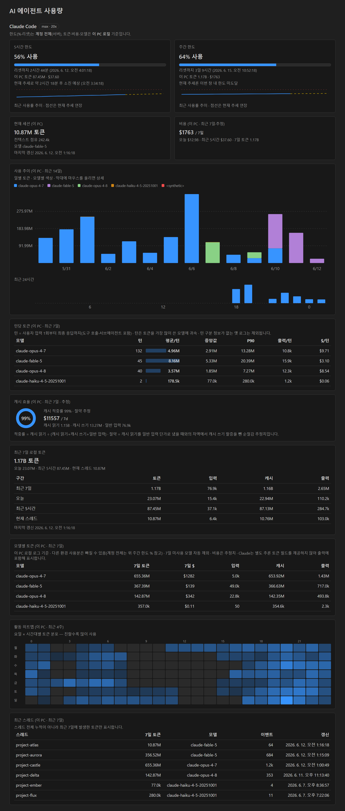
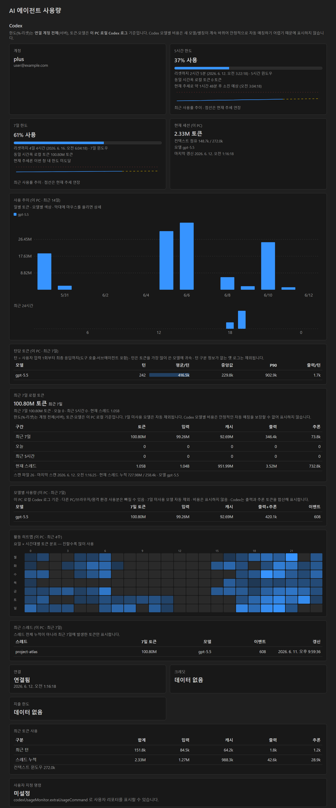

# AI 에이전트 사용량 모니터 (Codex + Claude)

VS Code에서 **Codex와 Claude Code 사용량을 동시에** 항시 볼 수 있게 해주는 로컬 확장입니다.

두 에이전트 모두 **별도 로그인 없이** 이미 로그인된 CLI의 자격증명을 그대로 재사용합니다.

- **Codex**: 로컬 `codex app-server --stdio` 를 실행해 현재 세션의 계정/제한/토큰을 실시간으로 받아옵니다. (`auth.json` 토큰을 복사하지 않음) 비용은 표시하지 않고 한도·토큰·모델 사용량에 집중합니다.
- **Claude Code**: 공식 `/usage` 명령이 호출하는 것과 동일한 OAuth usage 엔드포인트를 `~/.claude/.credentials.json` 의 토큰으로 호출해 5시간/주간 한도를 받고, `~/.claude/projects/**/*.jsonl` 트랜스크립트에서 토큰·비용을 집계합니다. 토큰이 만료되면 자동 갱신합니다.

## 스크린샷

**Claude Code 섹션** — 한도 사용률 스파크라인(점선 = 추세 연장) · 최근 14일 사용 추이(모델별 스택) · 모델별 턴당 토큰(평균/중앙값/P90/$) · 캐시 효율(적중률·절약 추정) · 요일×시간 활동 히트맵:



**Codex 섹션** — 동일한 추이/턴당 통계/히트맵 시각화(비용 표시 제외 정책 유지):



> 스크린샷의 토큰·차트 수치는 실제 로컬 로그를 집계한 값이며, 계정·한도 %·스레드 이름은 예시/익명화된 값입니다. `node scripts/make-screenshots.js` 로 재생성할 수 있습니다.

## 기능

- VS Code 왼쪽 상태바에 `Codex`, `Claude` 두 항목을 나란히 표시
- 클릭하면 통합 대시보드 열기. 감지된 에이전트만 자동 표시하며, 하나만 감지되면 해당 섹션을 먼저 보여줍니다.
- **Claude**: 5시간/주간 한도 사용률(%)·리셋까지 남은 시간, 구간별(5h/7일) 토큰·비용, 현재 세션 토큰/컨텍스트 점유, 모델별(최근 7일) 토큰·비용, **최근 스레드(이 PC·최근 7일)**, Opus/Sonnet 전용 주간 한도(적용 시), 다른 환경 합치기
- **Codex**: 연결/계정, 사용 한도 윈도우(기본/보조)의 사용률 %·리셋·기간, 크레딧, 지출 한도, 최근 토큰, 최근 7일 로컬 토큰·모델·스레드, **다른 환경 합치기**, 사용자 지정 명령 출력
- 토큰은 트랜스크립트 파일 변경 감지로 실시간에 가깝게 갱신

### 시각화 / 인사이트 (Claude·Codex 공통, v0.8+)

외부 라이브러리 없이 인라인 SVG로 그려 오프라인·CSP 환경에서도 동작합니다.

- **사용 추이 차트**: 최근 14일 일별 토큰을 모델별 색상 스택 막대로, 최근 24시간을 시간별 미니 막대로 표시 (막대 위 마우스 오버로 상세)
- **턴당 토큰 통계**: 모델별로 1턴(사용자 입력→최종 응답, 도구 호출·서브에이전트 포함)의 평균·중앙값·P90·출력 토큰을 표시. 평균만이 아니라 분포를 함께 보여 "긴 턴 하나가 평균을 끌어올렸는지" 구분 가능. Claude는 턴당 추정 비용($)도 표시
- **캐시 효율 (Claude)**: 캐시 적중률 도넛과 "캐시 덕에 절약한 추정 비용"(캐시 쓰기 할증을 차감한 순절감) 표시
- **활동 히트맵**: 최근 4주 요일×시간대 토큰 분포 — 언제 많이 쓰는지 한눈에
- **한도 스파크라인**: 5시간/주간 한도 카드 안에 최근 사용률 추이를 그리고, 현재 추세 연장선(점선)과 100% 도달 예상점을 함께 표시

## 설치 / 적용

[Releases](https://github.com/kimbyungsu/codex-usage-monitor/releases) 에서 가장 최신 `codex-usage-monitor-*.vsix` 를 내려받아 설치합니다.

```powershell
# 내려받은 폴더에서 가장 최신 버전 자동 설치
code --install-extension (Get-ChildItem codex-usage-monitor-*.vsix | Sort-Object Name | Select-Object -Last 1).FullName --force
```

또는 VS Code 확장 패널 → `...` → `Install from VSIX...` 로 설치한 뒤 `Developer: Reload Window` 를 실행하세요.

상태바 왼쪽에 `Codex …` 와 `Claude …` 항목이 보입니다. 클릭하면 대시보드가 열립니다.

다른 PC에서 GitHub 소스로 빌드해 설치하려면:

```powershell
git clone https://github.com/kimbyungsu/codex-usage-monitor.git
cd codex-usage-monitor
npm install
npm run package
code --install-extension (Get-ChildItem codex-usage-monitor-*.vsix | Sort-Object Name | Select-Object -Last 1).FullName --force
```

`Developer: Reload Window` 후 적용됩니다.

명령 팔레트:

- `Codex 사용량 모니터: 대시보드 열기`
- `Codex 사용량 모니터: 새로고침` (Codex + Claude 모두)
- `Codex 사용량 모니터: 다시 연결` (Codex)
- `AI 사용량 모니터: Claude 새로고침`

## 설정

Codex

- `codexUsageMonitor.codexCommand`: Codex 실행 파일 경로/명령 (기본 `codex`)
- `codexUsageMonitor.refreshIntervalSeconds`: Codex 새로고침 주기 (기본 `60`초)
- `codexUsageMonitor.extraUsageCommand`: 별도 사용량 리포터 명령 출력 표시
- `codexUsageMonitor.codexExtraSessionPaths`: 다른 환경의 Codex `sessions` 폴더(또는 `.codex` 홈) 합산 경로 목록 (대시보드 "다른 환경 합치기"로도 추가 가능)
- `codexUsageMonitor.showStatusBar`: Codex 상태바 표시 여부
- `codexUsageMonitor.notifyOnStartup`: 시작 안내 알림 표시 여부

Claude

- `codexUsageMonitor.showClaudeStatusBar`: Claude 상태바 표시 여부
- `codexUsageMonitor.claudeConfigDir`: Claude 설정 폴더 경로 (비우면 `CLAUDE_CONFIG_DIR` 또는 `~/.claude`)
- `codexUsageMonitor.claudePlanRefreshSeconds`: 플랜 한도(5h/주간) 새로고침 기본 주기 (기본 `120`초, 최소 30초). 이 값이 하한이며, 429 시 간격이 ×2로 늘었다가(최대 15분) 이 값으로 수렴(그 아래로 안 내려감).
- `codexUsageMonitor.claudeTokenRefreshSeconds`: 토큰 재집계 주기 (기본 `15`초, 파일 변경 감지와 병행)
- `codexUsageMonitor.claudeExtraProjectPaths`: 다른 환경의 projects 폴더 합산 경로 목록 (대시보드 "다른 환경 합치기"로도 추가 가능)

## 개발 / 테스트

통합 테스트 하니스(`@vscode/test-electron`)로 지정한 VS Code 버전(기본 1.96 = Node 20)을 내려받아 확장 호스트 안에서 TLS/usage 호출을 실측합니다.

```powershell
npm test                          # 기본 1.96.0에서 실행
$env:VSCODE_TEST_VERSION="1.105.0"; npm test   # 버전 지정
```

> **Windows 경로 제약**: `@vscode/test-electron`는 확장 경로에 **공백/일부 비ASCII(한글 등)** 가 있으면 테스트 호스트로 넘기는 인자가 공백에서 잘려 실패합니다. 이 저장소 경로(예: `에이전트 활용`)가 그렇다면, **공백·한글이 없는 경로로 복사**한 뒤 거기서 `npm test` 를 실행하세요.
> ```powershell
> robocopy . C:\dev\codex-usage-monitor /E /XD node_modules .vscode-test | Out-Null
> robocopy .\node_modules C:\dev\codex-usage-monitor\node_modules /E | Out-Null
> cd C:\dev\codex-usage-monitor; npm test
> ```

환경 특이사항(필요할 때만):
- **TLS 가로채기 프록시/백신 환경**: npm 설치와 VS Code 다운로드가 인증서 검증으로 막히면, OS 신뢰 인증서를 PEM으로 묶어 물려주세요.
  ```powershell
  node -e "const fs=require('fs'),tls=require('tls');fs.writeFileSync('.systemca.pem',[...tls.getCACertificates('default'),...tls.getCACertificates('system')].join('\n'))"
  $env:NODE_EXTRA_CA_CERTS=(Resolve-Path .systemca.pem).Path; npm test
  ```
- **Electron 기반 셸(예: VS Code 통합 터미널/일부 에이전트)에서 실행 시** `ELECTRON_RUN_AS_NODE=1`이 상속되면 테스트용 Code.exe가 GUI 대신 Node로 떠 실패합니다. 그럴 땐 `Remove-Item Env:\ELECTRON_RUN_AS_NODE` 후 실행하세요. 일반 터미널/CI에서는 해당 없음.

> 실측 결과(이 저장소): VS Code **1.96.0(Node 20.18.1)** 확장 호스트에서 usage 호출이 **인증서 검증을 통과**하고 실제 한도 데이터를 수신함을 확인(`1 passing`). Node 20에는 `tls.getCACertificates`가 없어 코드의 병합은 no-op이며, VS Code의 시스템 인증서 처리가 이를 보장합니다.

## 참고 / 한계

- **Claude 한도(5시간/주간 %·리셋)** 는 `/usage` 와 동일한 실제 값입니다. 단, 이 값은 공식 문서화되지 않은 내부 OAuth usage 엔드포인트(공식 Claude Code CLI가 `/usage` 에서 쓰는 것과 동일)에서 받아옵니다. **비공식 경로라 향후 변경 시 한도 표시가 동작하지 않을 수 있습니다.** 그 경우에도 토큰·비용·모델 집계(로컬 JSONL 기반)는 독립적으로 계속 동작하며, 상태바는 로컬 토큰 정보로 자동 폴백합니다.
- **Claude 비용(USD)** 은 모델별 공개 단가로 환산한 추정치이며, 구독 사용자의 실제 청구액이 아니라 'API 환산 비용'입니다.
- **TLS / 인증서**: 한도 조회는 HTTPS로 이뤄지며 **VS Code의 시스템 인증서·프록시 처리**(`http.systemCertificates` 기본 켜짐, `http.proxy`)를 그대로 따릅니다. 사내 백신/프록시 루트가 OS 신뢰 저장소에 있으면 검증이 정상 통과합니다. 추가로, 확장 호스트 Node가 지원하는 신버전(Node 22+의 `tls.getCACertificates`)에서는 OS 인증서를 직접 병합해 한 번 더 보강합니다. 인증서 검증 실패가 계속되면 VS Code의 위 설정을 확인하세요. (인증서 검증을 끄는 옵션은 OAuth 토큰 보호를 위해 사용자 설정으로 제공하지 않습니다.)
- **Codex 비용 제외**: Codex 로그의 모델 ID와 별칭은 새 모델이 나올 때마다 바뀔 수 있어 모델별 비용 자동 매칭을 안정적으로 보장하기 어렵습니다. 그래서 Codex는 비용을 표시하지 않고, 계정 한도·리셋·로컬 토큰·모델별 토큰만 표시합니다.
- **데이터 범위**: 한도 %는 계정 전체(모든 환경 합산), 토큰·모델은 이 PC 로컬 로그 기준입니다. Claude 비용은 로컬 로그의 모델별 공개 단가로 환산한 추정치입니다. 다른 환경을 합치려면 대시보드 하단 "다른 환경 합치기" 에서 폴더를 추가하세요. (Claude·Codex 양쪽 모두 지원)
- **대용량 트랜스크립트**: Claude/Codex 세션 로그(`.jsonl`)는 장기 세션에서 수백 MB~GB까지 커질 수 있습니다. 파일 전체를 한 번에 문자열로 읽으면 Node 문자열 한계(~512MB) 초과 시 읽기에 실패해 해당 세션이 통째로 집계에서 누락될 수 있으므로, 청크 스트리밍으로 줄 단위 파싱합니다(크기 무관 안전, 멀티바이트 경계 보존). 활성 세션은 증분 파싱으로 가볍게 갱신합니다. 이 처리는 최근 7일 토큰뿐 아니라 모델별·최근 스레드·현재 세션 등 로컬 집계 출력 전체에 동일하게 적용됩니다.
- **한도 소진 예상**: 최근 사용률 추세로 한도 도달 시점을 추정합니다. 해당 창이 리셋되기 전에 도달할 추세일 때만 "약 N 후 소진 예상"을 표시하고, 그 전에 리셋될 추세면 "현재 추세론 이번 창 내 한도 미도달"로 표시합니다(5시간 창에 "2일 후 소진" 같은 창 주기와 모순되는 표기 방지). Claude·Codex 양쪽에 동일 적용됩니다.
